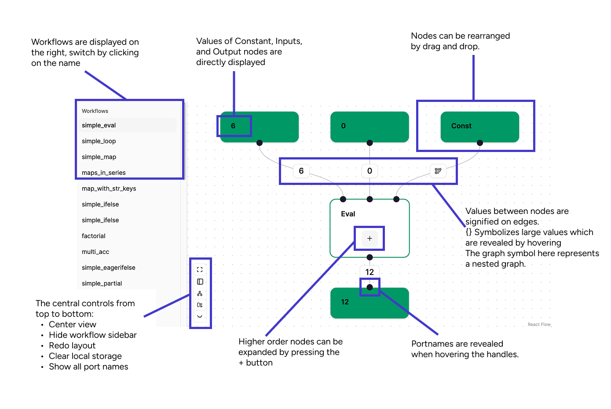
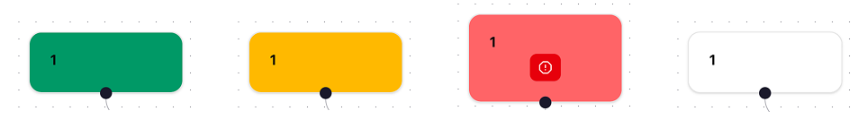
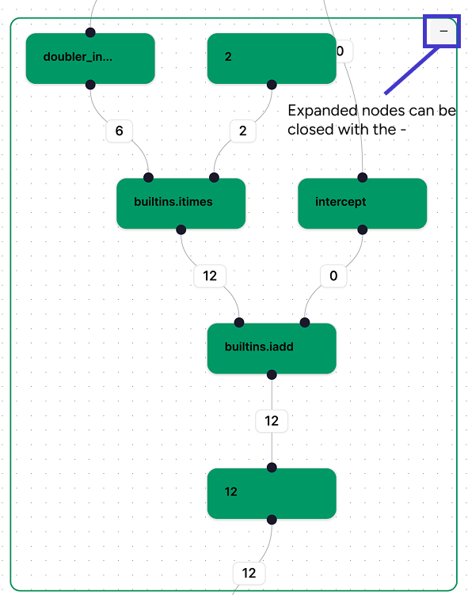
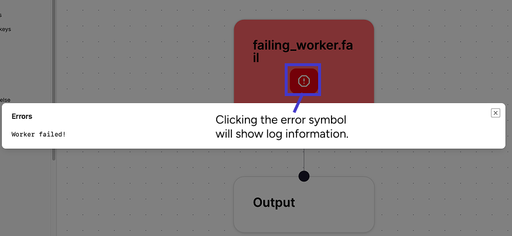

# Visualization

To aid development, `tierkreis` provides an visualizer.
It can be installed with

```
pip install tierkreis-visualization
```

It extends the `tkr` cli with a `viz` subcommand which can be invoked as:

```
tkr viz
```

This will start a fastapi development server which by default shows all from the checkpoint directory `~/.tierkreis/checkpoints`.
It will only include graphs that have been run with `FileStorage` at this location.

## Running the visualizer

The visualizer is browser based and can be accessed at:
[http://localhost:8000](http://localhost:8000)

Programmatically the server can be run from python

```py
from tierkreis_visualization.main import start

start()
```

Alternatively you can visualize a graph that is still under construction using the syntax

```bash
uv run tkr_viz_graph <PATH_TO_PYTHON_FILE>:<VARIABLE_CONTAINING_GRAPH>
```

For example one could run the following command from the root of the Tierkreis repo.

```bash
uv run tkr_viz_graph examples/defaults.py:outer_g
```

which will show one of the examples in the Tierkreis repo as a partially constructed graph.
If you delete the optional 'extra' output on line 62 then the browser will live reload displaying the updated graph.

Programmatically this is available through:

```py
from tierkreis.builder import GraphBuilder
from tierkreis_visualization.visualize_graph import visualize_graph

graph = GraphBuilder()
visualize_graph(graph)
```

which will block the execution.
Reloading is not available through the programming interface.

## Usage

The visualizer provides plenty information about the graphs in the system.


### General Functionality

The nodes in the graph can be freely move by dragging them around the plane.
At the bottom left of the main view there are three control buttons from top to bottom:

- Centering the view
- Hiding the navigation bar
- Recalculation the graph layout
- Reset Local storage, sometimes graph changes are not update correctly, clearing the storage and reloading resets the view
- Showing/Hiding all node ports

### Available Graphs

Available graphs are listed in the sidebar by their name.

### Node Types

The visualizer will show the different node types with their heading.
Tasks will be displayed by their function names and constant values, inputs and outputs have their values attached.

### Node Status

The node status is indicated by the border color of the nodes:



- Yellow: Node is currently running
- Green: Node is finished
- Red: An error has occurred in the node (or one of its nested nodes)
- White/No border: Node has not been started yet

### Ports & Values

Inputs and outputs of nodes are indicated by black circles (handles) on the nodes border.
Inputs are at the top, outputs at the bottom.
Hovering a port will show the port name.
By using the control button, all ports can be shown simultaneously.
The values in a graph are only visible once the graph has run, indicated on the edges connecting a port.
Small values will be displayed, larger values are truncated with a `{}` symbol.
Hovering the symbol shows the entire value in json format.
The graph symbol indicates a value is a constant subgraph supplied as a nested graph.

### Nested Graphs

The higher order nodes `eval`, `map`, and `loop` can be expanded by pressing the `+` button.
This will show their nested structure.


For `eval` nodes this will immediately be the nested graph;
For `map`/`loop` nodes this will show the individual elements/iterations which each contain their own subgraph.
For unevaluated graphs, this will only show a placeholder evaluation.
To hide the graph again use the `-` button at the top right.

### Logs & Errors

Logs can be accessed by double-clicking a node.
If an error has occurred on a node, it will have a `!` button.
Pressing it will show the error information.


