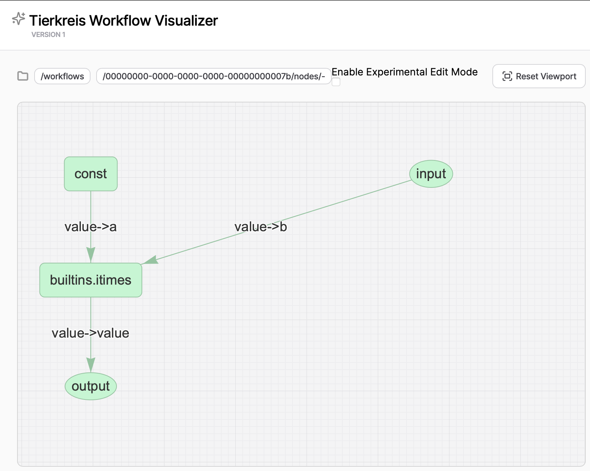

# Tierkreis

Tierkreis is a higher-order dataflow graph program representation and runtime
designed for compositional, quantum-classical hybrid algorithms.

For a detailed introduction read the paper:
[Tierkreis: a Dataflow Framework for Hybrid Quantum-Classical Computing](https://arxiv.org/abs/2211.02350).

This repository contains the source for the `tierkreis` python package.
The python package provides a complete development and testing environment for writing and running Tierkreis program, and allows you to write extensions ("workers") in python.

## Getting Started

To install the python package run:

```bash
pip install tierkreis
```

This package is pure python and is compatible with Python 3.10 and above.
In it's simplest form, `tierkreis` takes a computation graph (a workflow) and executes it.
To simply run a workflow we can use the `run_workflow` function:

```python
run_workflow(
    graph = times_5(),
    inputs = {Labels.VALUE: json.dumps(3).encode()},
    run_id = 123,
    name="times_5",
    print_output=True,
)
```

### Build graphs

A workflow graph can be constructed by adding nodes to a graph object.
For each node one has to define the input and output ports of the node.
The following example shows how to multiple a user input with a constant value.

```python
def times_5() -> GraphData:
    """A graph that calculates input*5 """
    g = GraphData()
    # declare the constant value 5 with the output port "value"
    const = g.add(Const(5))("value")
    # declare the Input node that reads from a port "value" and maps to a port "value"
    user_input = g.add(Input("value"))("value")
    # use a built in functionality that takes two inputs "a" and "b" and maps to a port "value"
    output = g.add(
        Func("builtins.itimes", {"a": const, "b": user_input})
    )("value")
    # the final output of the graph is put out at a port "value"
    g.add(Output({"value": output}))
    return g
```

### Visualize

To visualize a workflow we provide a separate package `tierkreis-visualize` found [here](https://pypi.org/project/tierkreis-visualization/).
It can be invoked from the command line with `tkr-vis`.
Opening [`localhost:8000`](https://localhost:8000) will open a browser window with the visualization.



### CLI

Tierkreis comes with a command line interface for running workflows.
To see all available options use `tkr --help`.
To run the hello world example from the cli

```
uv run tkr -g examples/hello_world/hello_world_graph.py:hello_graph -i data.json --uv --registry-path examples/hello_world/ -o
```

Explanation:

- `-g` specifies the graph to run by specifying the location and function to run.
- `-i` specifies the input for the graph function. In this case it loads a json file from the project root with the contents `{"value": "world!"}`
- `--uv` enables the use of the UV executor.
- `--registry-path` specifies the location of the registry to use for the UV executor.
- `-o` enables output printing.

### Examples

For more involved examples see [examples directory](../examples).

## Under the Hood

Under the hood, Tierkreis consists of three main components.

- **Controller**: The controller orchestrates the workflow and progresses the computation.
- **Executor**: Executors are responsible to execute external function calls implemented by workers.
- **Worker**: A worker is a standalone program which conforms to the tierkreis worker interface.

The `run_workflow()` function provides sensible defaults which can be replaced as needed.
Roughly, a workflow runs by

```python
graph = times_5()
# Define a file based controller
storage = ControllerFileStorage(UUID(int=id), name=name, do_cleanup=True)
# Define an executor running binaries from the shell
executor = ShellExecutor(
    Path("./examples/launchers"), logs_path=storage.logs_path
)
inputs = {Labels.VALUE: json.dumps(3).encode()},
run_graph(storage, executor, g, inputs)

output_ports = g.nodes[g.output_idx()].inputs.keys()
actual_output = {}
for port in output_ports:
    print(json.loads(storage.read_output(Loc(), port)))
```

### Controller

The controller internally stores the progress of the workflow including:

- The definition of nodes
- The status of nodes (not started, started, error, done)
- A map between node in- and output ports

By default this is stored in the filesystem under `~/.tierkreis/workflows/<workflow_id>/`.

### Executor

An executor defines a way to run workers in a workflow.
For example the `UVExecutor` provided out of the box, will run a python program by executing

```shell
uv run main.py <node_definition_path>
```

The command will be executed in the _registry_ directory of multiple workers which can be configured manually:

```python
executor = UVExecutor(registry_path=Path("/example/example_workers"))
# the path to the directory where workers are stored
```

### Worker

_Workers_ are standalone programs which implement a set of functions which can connect to a Tierkreis controller to add extra primitives.
To define python based workers that run in an isolated environment, you can use the build in `Worker` utilities and the `UVExecutor`.

For example, we could define a custom hello world worker:

```python
# The following defines the python program for uv
# /// script
# requires-python = ">=3.12"
# dependencies = ["pydantic", "tierkreis"]
#
# ///
import logging
from sys import argv
from pathlib import Path
from tierkreis import Worker, Value

logger = logging.getLogger(__name__)
worker = Worker("hello_world_worker")

# Workers can expose multiple functions returning a Value object
@worker.function()
def greet(greeting: str, subject: str) -> Value[str]:
    logger.info("%s %s", greeting, subject)
    return Value(value=greeting + subject)

# The worker will be invoked from the executor with the node definition path as the only argument
def main() -> None:
    node_definition_path = argv[1]
    logger.info(node_definition_path)
    worker.run(Path(node_definition_path))

if __name__ == "__main__":
    logger.info("starting worker")
    main()
```

In a graph such a worker would be invoked by calling

```python
    g = GraphData()
    hello = g.add(Const("hello "))("value")
    subject = g.add(Const("world!"))("value")
    output = g.add(
        Func("hello_world_worker.greet", {"greeting": hello, "subject": subject})
    )("value")
    g.add(Output({"value": output}))
```
