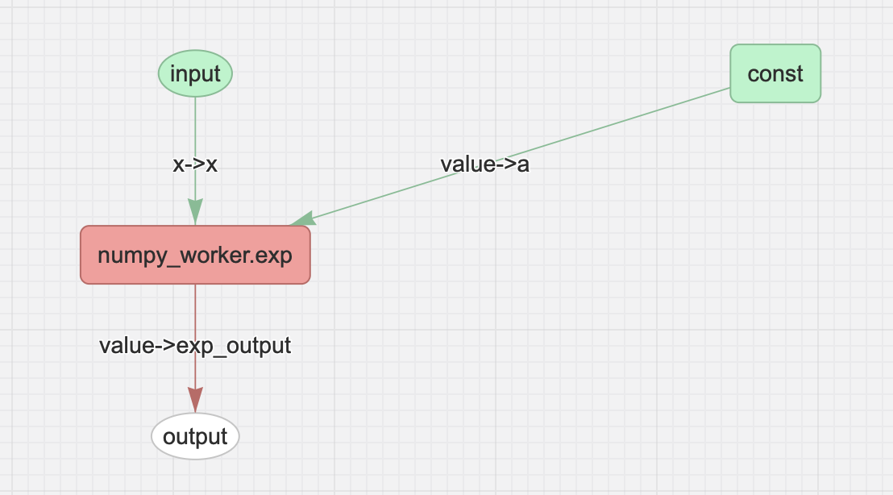

Building Workflows with Tierkreis
=================================

In ``tierkreis``, workflows are constructed from computation graphs (DAGs).
Each node in the graph represents an operation; edges represent the flow of data.
Incoming edges represent inputs, outgoing edges represent outputs.
This guide will show you how to build your own computation graph, execute it and visualize the results.

Define a computation graph
--------------------------

In the following we are constructing a simple computation graph that computes
..math
    f(x) = a * \exp(x)

Where `a` is a constant value, `x` is the input to the function and `f(x)` is the output.

1. Available Operations
^^^^^^^^^^^^^^^^^^^^^^^

The currently available operations are defined in type `NodeDef <https://github.com/CQCL/tierkreis/blob/main/tierkreis/tierkreis/controller/data/graph.py>`_.

Broadly there are four types of operations:
1. Values: ``Const``, ``Input``, ``Output``
2. Higher order constructs: ``Eval``, ``Map``, ``Loop``
3. Control flow: ``IfElse``, ``EagerIfElse`` which differ in their behavior
4. Function definitions: ``Func``

The ``Func`` operation is very powerful and can run custom code, which we will see in when defining a custom worker in :ref:`custom_worker`.
The drawback of this approach is that it will be always run as a single node in the graph.

2. Construct a workflow graph
^^^^^^^^^^^^^^^^^^^^^^^^^^^^^

Constructing a workflow is done by creating a ``Graph`` object, which contains all the nodes in the graph.
An important aspect is setting up the in and outputs of each node.
In general each node accepts at least one input and produces at least one output.
The ``Graph`` object also contains a map between in- and outputs, which is used to connect nodes together.
The core function for this is ``Graph.add`` which takes a node definition, and produces a callable, which typically is immediately called.
``g.add(Input("my_input"))("my_input")`` creates a named input (``my_input``) with an output label ``"my_input"``.
When constructing a graph, the result of such a call can then be feed as input to another node.

A full construction looks like this:
.. code-block:: python
    from tierkreis.controller.data.graph import (
        Const,
        Func,
        GraphData,
        Input,
        Output,
    )
    from tierkreis import Labels

    g = GraphData()
    x = g.add(Input("x"))("x")
    a = g.add(Const(5))(Labels.VALUE)
    exp = g.add(Func("numpy_worker.exp", {"x": x, "a": a}))(Labels.VALUE)
    g.add(Output({"exp_output": exp}))

Since out of the box, there exists no exponential function node, we are going to construct a custom worker for this.

:: _worker:
3. Build a custom worker
^^^^^^^^^^^^^^^^^^^^^^^^
``Workers`` allow Tierkreis to run custom functions and therefore extend available functionality.
These workers can run local or remotely and either be implemented in python or provide a binary.
As input, workers receive the node definition of the ``Func`` node, which contains paths, inputs, outputs and parameters.
Out of the box, Tierkreis provide a couple of default workers see `pypi <https://pypi.org/search/?q=tkr+worker&o=>`_.

Creating a worker in python is straight forward:
Sep up a project and add a ``pyproject.toml`` file with the following content:
For illustration purposes we will use ``numpy`` as an example, but not declare it in the dependencies to produce an error we can fix later.

.. code-block:: toml
    requires-python = ">=3.12"
    dependencies = ["pydantic", "tierkreis"]

    [tool.uv.sources]
    tierkreis = { path = "../../../tierkreis", editable = true }

A worker can then be defined

.. code-block:: python
    from sys import argv
    from pathlib import Path
    from tierkreis import Worker, Value

    # name the workers
    worker = Worker("numpy_worker")

    # declare the exp function consuming two floats and returning
    @worker.function()
    def exp(x: float, a: float) -> Value[float]:
        import numpy as np
        return Value(value=a*np.exp(x))

    def main() -> None:
        node_definition_path = argv[1]
        worker.run(Path(node_definition_path))

    if __name__ == "__main__":
        main()

Here the heavy lifting is done through the ``@worker.function()`` annotation.
Building a custom worker is a more involved process:
1. Load and parse the node definition file
2. Provide (error) logging
3. In case of an error, this needs to be raised to the controller by creating an `_error` file in the node directory
4. Write the outputs to the correct ports
5. Signal completion of execution to the controller by creating a file called ``_done`` in the node directory

4. Selecting an executor
^^^^^^^^^^^^^^^^^^^^^^^^
Workers will be executed as a individual process, initiated by an ``Executor``.
Tierkreis offers a number of executors:
- ``builtin`` for all builtin functionality such as ``iadd``
- ``ShellExecutor`` for running binary programs
- ``UVExecutor`` for running standalone Python processes
- ``MultipleExecutor`` for composing multiple different executors (e.g., ``UVExecutor`` + ``ShellExecutor``)

In our case we want to use the ``UVExecutor`` which will run ``uv run main.py`` with the ``node_definition_path`` as first argument.
For the above worker the ``UVExecutor`` is sufficient which can be configured before running the workflow.
An important argument to the constructor is ``registry_path`` which signifies the directory where the ``worker`` is located.
The command mentioned above will be executed in the specified directory.

Running and monitoring your computation graph
---------------------------------------------

Once defined, the workflow can be handed to the runtime for execution.
For monitoring purposes you can either use the ``TUI``(WIP) or the web interface. 

1. Executing the workflow
^^^^^^^^^^^^^^^^^^^^^^^^^
Before running the workflow all inputs must be defined.
For our example we define an input for the ``x`` label which is set to 5.
Running the workflow can be done in two ways:

.. code-block:: python
    from pathlib import Path
    import json
    from tierkreis.cli.run_workflow import run_workflow

    inputs = {"x": json.dumps(5).encode()}
    run_workflow(
        g,
        inputs,
        name="exp",
        run_id=42,  # Assign a fixed uuid for our workflow.
        registry_path=Path(__file__).parent,
        # Look for workers in the same directory.
        use_uv_worker=True,
        print_output=True,
    )
The ``run_workflow`` function sets sensible defaults.

A more verbose way of running can be achieved by manually setting an executor and controller:

.. code-block:: python
    storage = ControllerFileStorage(UUID(int=42), name="exp")
    executor = UvExecutor(Path(__file__).parent, logs_path=storage.logs_path)
    storage.clean_graph_files()
    run_graph(storage, executor, g, {}, n_iterations=1000)

2. Visualizing and monitoring the workflow
^^^^^^^^^^^^^^^^^^^^^^^^^^^^^^^^^^^^^^^^^^

To visualize the workflow you can use the ``tierkreis-visualizer`` python package.
It scans the tierkreis directory ``~/.tierkreis`` for available workflow results.
Run ``tkr-vis`` from a terminal and navigate to the `webview <localhost:8000>`_.
There you can find a list of all available workflows which on inspection will show the corresponding computation graph.

If everything worked correctly you should see the following:

The status of a node is indicated by its color.
- green: done successfully 
- yellow: in progress
- red: failed computation, an error occurred
- white: not started yet

Which means that in this case the ``numpy_worker`` node has an error.
By clicking the node you can see more information about the error in this case learning

::
    No module named 'numpy'

which is expected since the dependency was not declared.
Adding ``numpy`` to the dependencies in :ref:`custom_worker`.
  
3. Using the logs
^^^^^^^^^^^^^^^^^

As an alternative, the logs and filestorage can be used for debugging purposes.
The execution logs can be found at ``~/.tierkreis/checkpoints/<node_id>/logs``. 
In this directory all nodes are stored, with a unique id.
Files of interest are ``_done`` and ``_error`` indicating the status of each node.
``nodedefinition`` contains the entire call arguments and node information; ``nodedef`` the actual values.
Potential errors should be logged to ``errors`` by workers.

